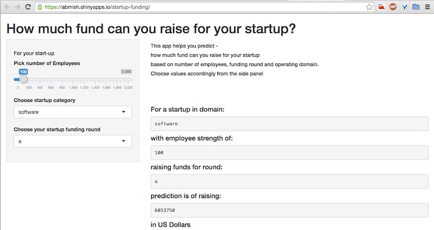

## Idea

###  The '__startup-funding__' app predicts     
### 'how much fund can you raise for your startup?'    
  
### Every founder/ co-founder wants an idea of the amount to begin with so this app presents a very basic prediction model   


--- .class #id 

## Data 
### The basis of prediction is a subset of publicly available funding data on Crunchbase about startups.  
it is available to everyone after registration at [crunchbase- data api]
(https://info.crunchbase.com/about/crunchbase-data-exports/)  

###  The most basic parameters are headcount, funding round and domain of operation
  

--- .class #id  


## Data Preparation  
####  There is lot of noise in data, so prepare it for consumption   


```r
raw_funding <- data.frame(read.csv("TechCrunchcontinentalUSA.csv", header = T, 
                                   colClasses=c("NULL","NULL", "numeric", NA, "NULL", 
                                                "NULL", "NULL", NA, "NULL", NA)))  
funding <- raw_funding[complete.cases(raw_funding[, c('numEmps')]), ]  
funding <- funding[(funding$category %in% c('mobile', 'software', 'web')),]  
summary(funding)  
```

```
##     numEmps              category     raisedAmt             round    
##  Min.   :    0.00   web      :465   Min.   :    10000   a      :203  
##  1st Qu.:    7.00   software : 49   1st Qu.:  1000000   b      :114  
##  Median :   20.00   mobile   : 15   Median :  3500000   angel  : 81  
##  Mean   :   87.78            :  0   Mean   :  8109098   seed   : 65  
##  3rd Qu.:   50.00   biotech  :  0   3rd Qu.:  9000000   c      : 42  
##  Max.   :20000.00   cleantech:  0   Max.   :300000000   d      : 11  
##                     (Other)  :  0                       (Other): 13
```
Amount is predicted with rest of the parameters  

--- .class #id   


## Shiny App
1. Available at [https://abmish.shinyapps.io/startup-funding/](https://abmish.shinyapps.io/startup-funding/)  
2. Change headcount, funding round and domain to view prediction  

  
